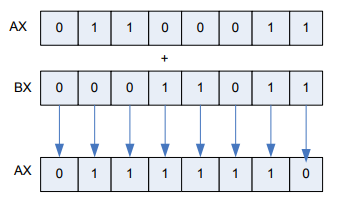

<h1 align="center">MiniCompiler</h1></br>
MiniCompiler is a compiler that can compile the commands given under the Commands heading. The computer on which the compiler runs has 8-bits of RAM and 2KB of memory. The processor has 8-bit registers such as AX,BX,CX,DX.

## Commands 

- HRK X1,X2 (Assignment operator X1 = X2)
- TOP X1,X2 (Addition X1 = X1 + X2)
- CRP X1,X2 (Multiplication X1 = X1 * X2)
- CIK X1,X2 (Substraction X1 = X1 - X2)
- BOL X1,X2 (Division X1 = X1 / X2)
- VE X1,X2 (AND operator X1 = X1 && X2)
- VEYA X1,X2 (OR operator X1 = X1 || X2)
- DEG X1,X2 (Logical not operator X1 = !X1)
- SS ADDRESS (If the result of the operation done before this code is zero, it branchs to the address given as "ADDRESS")
- SSD ADDRESS (If the result of the operation done before this code is not  zero, it branchs to the address given as "ADDRESS")
- SN ADDRESS (If the result of the 
operation done before this code is negative, it branchs to the address given as "ADDRESS")
- SP ADDRESS (If the result of the operation done before this code is positive, it branchs to the address given as "ADDRESS")

## Addressing
VALUE = 0-255
**Direct Addressing** = HRK [MEMORY_ADDRESS] or REGISTER,VALUE
**Indirect Addressing** = HRK REGISTER,    [ [VALUE] ]
This code branches according to the memory address in the "VALUE" address in the memory.

## Loops
**Mini-Compiler code sample :** 

```
HRK AX,10
TAG:TOP BX,1
CIK AX,1
SP TAG
```    
**Pseudo Code :**
```
for (AX = 10; AX >= 0; AX--) {
    BX++
}
```

## Example 

AX = 01100011 , BX = 00011011

The working principle of the TOP AX,BX command is given in the image below.



## Getting Started

In order to compile the codes you wrote with Mini-Compiler commands in a text file, the source code can be in the file location where assembler.c is located, or it can also be accessed by typing the file path (Directory must have double slashes.). There is a source code sample in the repo. 